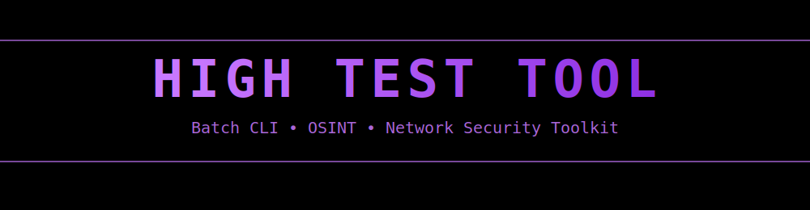

<p align="center">
  
</p>

<p align="center">
  
  
  
  
</p>

<h1 align="center">HIGH TEST TOOL</h1>

<p align="center">
Batch CLI OSINT & Network Security Toolkit
</p>


# ⚠️ Disclaimer

High Test Tool is developed strictly for:

- ✅ Authorized penetration testing  
- ✅ Cybersecurity education  
- ✅ Private lab environments  
- ✅ Defensive security research  

**Do not use this tool against systems you do not own or have explicit written authorization to test.**

The developer assumes no responsibility for misuse.

---

# 🟣 Overview

High Test Tool is a Windows-native Batch CLI multi-tool built for ethical hackers, cybersecurity students, and lab operators.

It is:

- Lightweight  
- Modular  
- Terminal-native  
- Dependency-minimal  

Designed for controlled environments and responsible research.

---

# 🧰 Feature Categories

## 🌐 Network & Enumeration
- Network Diagnostics Tool
- Netscan
- Port Scanner (Audit Mode)
- Reverse DNS Lookup
- Trace DNS
- RPC Enumeration
- Domain Controller Manager

## 🛰 OSINT & Intelligence
- IP Geolocation
- Phone Lookup
- MAC Address Trace

## 🔐 Security Lab Modules (Authorized Testing Only)
- ARP Lab Simulation
- Session Analysis Module
- Credential Strength Tester
- Archive Password Recovery (Lab Use)
- Network Stress Test Simulator (Private Labs Only)

---

# 💻 Requirements

- Windows 10 / 11
- Command Prompt
- Administrator privileges (for certain modules)
- Internet connection (for OSINT modules)

No external frameworks required.

---

# 🚀 Installation

```bash
git clone https://github.com/DogEaterFN/High-Test-Tool.git
cd High-Test-Tool
start hightesttool.bat
Or download the repository ZIP and run:

Copy code
hightesttool.bat
🖥 Usage
Launch from Command Prompt:

Copy code
hightesttool.bat
Navigate through the CLI menu to select modules.

Each module operates independently and is separated for safe execution.

---

📁 Project Structure

bash
Copy code
High-Test-Tool/
│
├── hightesttool.bat          # Main launcher
│
├── config/
│   ├── settings.conf         # User configuration
│   └── theme.conf            # UI + color settings
│
├── modules/
│   ├── network/
│   │   ├── network_tool.bat
│   │   ├── netscan.bat
│   │   ├── port_scan.bat
│   │   ├── reverse_dns.bat
│   │   ├── trace_dns.bat
│   │   └── rpc_enum.bat
│   │
│   ├── osint/
│   │   ├── geolocate.bat
│   │   ├── phone_lookup.bat
│   │   └── mac_trace.bat
│   │
│   └── security_lab/
│       ├── arp_lab.bat
│       ├── session_analysis.bat
│       ├── credential_tester.bat
│       ├── archive_recovery.bat
│       └── stress_test_sim.bat
│
├── logs/
│   └── (runtime logs generated here)
│
├── assets/
│   └── banner.gif
│
├── README.md
└── LICENSE

🎨 Theme

High Test Tool uses a custom purple terminal theme:

Copy code

Black background + RGB(200,120,255) accent for a clean underground aesthetic.

🛡 Ethical Usage Policy
This project is intended for:

Cybersecurity students

Virtual machine lab testing

Bug bounty research (within scope)

Defensive security audits

Improper use may violate local, state, or federal laws.

📌 Roadmap

Plugin-based module loader

Improved logging system

Configurable profiles

Better CLI navigation

Modular auto-discovery system

🤝 Contributing

Pull requests are welcome.

Keep modules:

Modular

Documented

Safe for authorized testing environments

📜 License

This project is licensed under the MIT License.

See the LICENSE file for full details.
